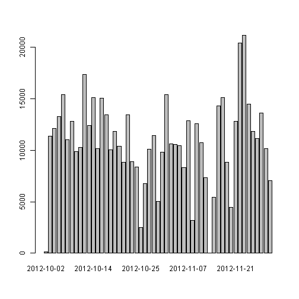
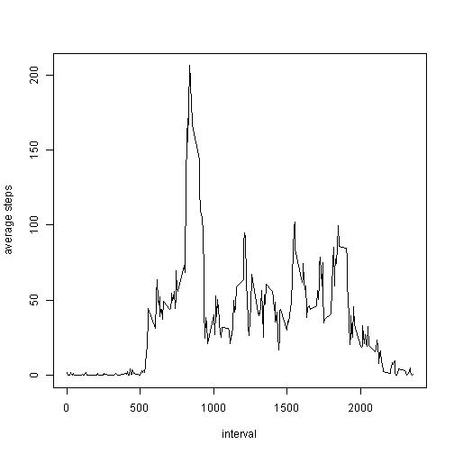
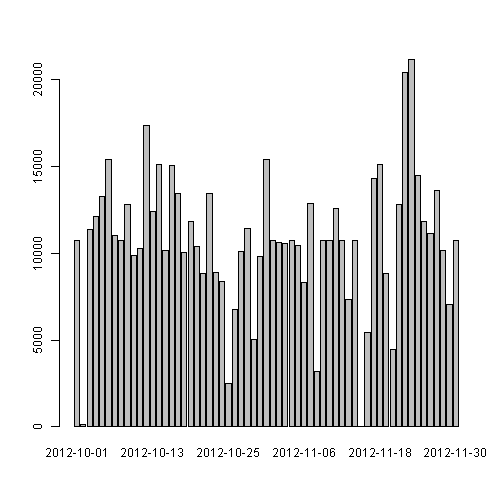
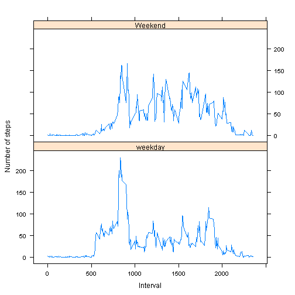

# Reproducible Research: Peer Assessment 1

This assignment makes use of data from a personal activity monitoring device. This device collects data at 5 minute intervals through out the day. The data consists of two months of data from an anonymous individual collected during the months of October and November, 2012 and include the number of steps taken in 5 minute intervals each day.

## Data

The variables included in this dataset are:

- steps: Number of steps taking in a 5-minute interval (missing values are coded as NA)
- date: The date on which the measurement was taken in YYYY-MM-DD format
- interval: Identifier for the 5-minute interval in which measurement was taken

The dataset is stored in a comma-separated-value (CSV) file and there are a total of 17,568 observations in this dataset.

## Loading and preprocessing the data


```r
unzip("activity.zip")
dataset<-read.csv("activity.csv", colClasses=c("integer", "Date", "integer"))
```

## What is mean total number of steps taken per day?

For this part of the assignment, we can ignore the missing values in the dataset.


```r
datasetnona<-na.omit(dataset)
```

1 Make a histogram of the total number of steps taken each day


```r
stepsperday<-tapply(datasetnona$steps,datasetnona$date,sum)
barplot(stepsperday)
```

 

2 Calculate and report the mean and median total number of steps taken per day


```r
mean(stepsperday)
```

```
## [1] 10766
```

```r
median(stepsperday)
```

```
## [1] 10765
```

## What is the average daily activity pattern?

1 Make a time series plot (i.e. type = "l") of the 5-minute interval (x-axis) and the average number of steps taken, averaged across all days (y-axis)


```r
stepsperintervalmean<-aggregate(datasetnona$steps,by=list(interval=datasetnona$interval),mean)
plot(stepsperintervalmean,type="l",xlab="interval",ylab="average steps")
```

 

2 Which 5-minute interval, on average across all the days in the dataset, contains the maximum number of steps?


```r
stepsperintervalmean[which.max(stepsperintervalmean$x),1]
```

```
## [1] 835
```

## Imputing missing values

Note that there are a number of days/intervals where there are missing values (coded as NA). The presence of missing days may introduce bias into some calculations or summaries of the data.

1 Calculate and report the total number of missing values in the dataset (i.e. the total number of rows with NAs)


```r
dim(dataset[is.na(dataset[]),])[1]
```

```
## [1] 2304
```

2 Devise a strategy for filling in all of the missing values in the dataset.
   We will use the mean for that 5-minute interval.


```r
nadataset<-dataset[is.na(dataset[]),]
nadataset[,1]<-sapply(nadataset[,3],function(x) round(stepsperintervalmean[stepsperintervalmean$interval==x,2]))
```

3 Create a new dataset that is equal to the original dataset but with the missing data filled in.


```r
dataset2<-rbind(datasetnona,nadataset)
```

4 Make a histogram of the total number of steps taken each day 


```r
stepsperday2<-tapply(dataset2$steps,dataset2$date,sum)
barplot(stepsperday2)
```

 

and report the mean and median total number of steps taken per day.


```r
mean(stepsperday2)
```

```
## [1] 10766
```

```r
median(stepsperday2)
```

```
## [1] 10762
```

Do these values differ from the estimates from the first part of the assignment?
Sometimes differ.

What is the impact of imputing missing data on the estimates of the total daily number of steps?
Small impact.

## Are there differences in activity patterns between weekdays and weekends?

Use the dataset with the filled-in missing values for this part.

1 Create a new factor variable in the dataset with two levels - "weekday" and "weekend" indicating whether a given date is a weekday or weekend day.


```r
dataset2$weekday<-as.factor(sapply(dataset2$date, function(x) ifelse(weekdays(x) %in% c("Saturday","Sunday"), "Weekend", "weekday")))
```

2 Make a panel plot containing a time series plot (i.e. type = "l") of the 5-minute interval (x-axis) and the average number of steps taken, averaged across all weekday days or weekend days (y-axis).


```r
library("lattice")
steps2<-aggregate(dataset2$steps,by=list(interval=dataset2$interval,weekday=dataset2$weekday),mean)
xyplot(x~interval|weekday,data=steps2,type="l",layout=c(1,2),xlab="Interval",ylab="Number of steps")
```

 
